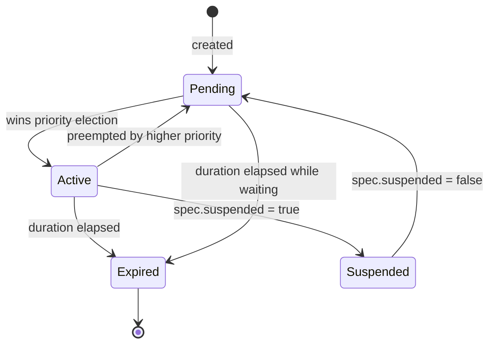

# ProfileActivation

A `ProfileActivation` activates a `ClusterProfile`. When multiple activations are simultaneously eligible, the **highest priority** wins.

## Spec

```yaml
apiVersion: config.kmorph.io/v1alpha1
kind: ProfileActivation
metadata:
  name: client-demo
spec:
  profileRef: production    # name of ClusterProfile to activate
  priority: 100             # higher = wins over lower
  duration: "4h"            # optional: auto-expires after this duration
  suspended: false          # optional: pause without deleting
  schedule:                 # optional: only active within this window
    start: "0 9 * * 1-5"
    end:   "0 18 * * 1-5"
    timezone: "Asia/Tokyo"
```

## Phases



| Phase | Meaning |
|-------|---------|
| `Active` | This activation is the current winner — its profile is being applied. |
| `Pending` | Eligible but preempted by a higher-priority activation. Takes over automatically when winner expires or is deleted. |
| `Expired` | Duration has elapsed. No longer considered. |
| `Suspended` | Paused via `spec.suspended: true`. Ignored by the controller. |

## Priority

Priority is an `int32`. Higher value wins. Ties are broken alphabetically by name (deterministic).

```
priority=0   → fallback (always active when nothing else is)
priority=10  → business hours schedule
priority=20  → sleep nights schedule
priority=100 → temporary production boost
priority=200 → emergency sleep (override everything)
```

## Schedules

Schedules use standard 5-field cron expressions:

```yaml
schedule:
  start: "0 9 * * 1-5"    # Monday-Friday 09:00
  end:   "0 18 * * 1-5"   # Monday-Friday 18:00
  timezone: "Asia/Tokyo"   # default: UTC
```

When outside the schedule window, the activation moves to `Pending`.

### Common patterns

```yaml
# Weekday business hours (JST)
schedule:
  start: "0 9 * * 1-5"
  end:   "0 18 * * 1-5"
  timezone: "Asia/Tokyo"

# Nights and weekends (JST)
schedule:
  start: "0 18 * * 1-5"
  end:   "0 9 * * 1-5"
  timezone: "Asia/Tokyo"

# Every day 22:00-08:00
schedule:
  start: "0 22 * * *"
  end:   "0 8 * * *"
```

## Duration

`duration` is a Go duration string. The activation auto-expires after this time from first becoming `Active`.

```yaml
duration: "4h"    # 4 hours
duration: "30m"   # 30 minutes
duration: "24h"   # 1 day
```

After expiry:
- Phase becomes `Expired`
- The next eligible activation by priority becomes `Active`
- `status.expiresAt` shows when it expired

## Common patterns

### Always-on fallback

```yaml
apiVersion: config.kmorph.io/v1alpha1
kind: ProfileActivation
metadata:
  name: fallback
spec:
  profileRef: minimal
  priority: 0
```

### Scheduled sleep/wake

```yaml
# Sleep nights and weekends
apiVersion: config.kmorph.io/v1alpha1
kind: ProfileActivation
metadata:
  name: sleep-nights
spec:
  profileRef: sleep
  priority: 20
  schedule:
    start: "0 18 * * 1-5"
    end:   "0 9  * * 1-5"
    timezone: "Asia/Tokyo"
---
# Business hours minimal
apiVersion: config.kmorph.io/v1alpha1
kind: ProfileActivation
metadata:
  name: business-hours
spec:
  profileRef: minimal
  priority: 10
  schedule:
    start: "0 9  * * 1-5"
    end:   "0 18 * * 1-5"
    timezone: "Asia/Tokyo"
```

### Temporary production boost

```yaml
apiVersion: config.kmorph.io/v1alpha1
kind: ProfileActivation
metadata:
  name: demo-today
spec:
  profileRef: production
  priority: 100
  duration: "4h"
```

Revert immediately by deleting:
```bash
kubectl delete pa demo-today
```

### Emergency override

```yaml
apiVersion: config.kmorph.io/v1alpha1
kind: ProfileActivation
metadata:
  name: emergency-sleep
spec:
  profileRef: sleep
  priority: 999   # overrides everything
```

## Status

```yaml
status:
  phase: Active
  activeProfile: production
  activeSince: "2026-06-10T09:00:00Z"   # reset on each Pending→Active transition
  expiresAt: "2026-06-10T13:00:00Z"
  nextTransition: "2026-06-10T18:00:00Z"
  lastAppliedTime: "2026-06-10T09:00:05Z"
  driftDetected: []                       # filled in soft/audit mode
  rolloutProgress: []                     # Argo Rollout promote tracking
```

## kubectl reference

```bash
# List with status
kubectl get pa

# Suspend without deleting
kubectl patch pa my-activation --type=merge -p '{"spec":{"suspended":true}}'

# Resume
kubectl patch pa my-activation --type=merge -p '{"spec":{"suspended":false}}'

# Delete to trigger immediate failover
kubectl delete pa my-activation

# Describe for full status + events
kubectl describe pa my-activation
```
