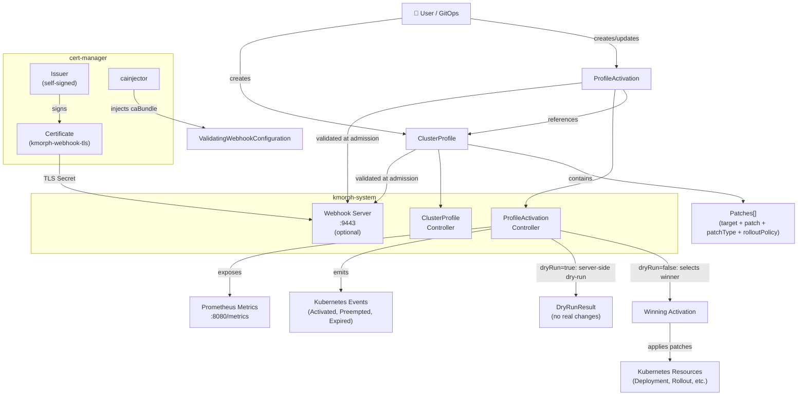
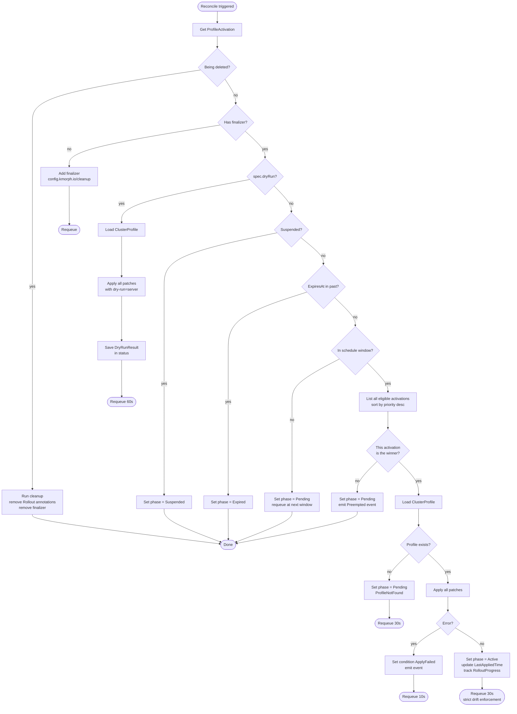
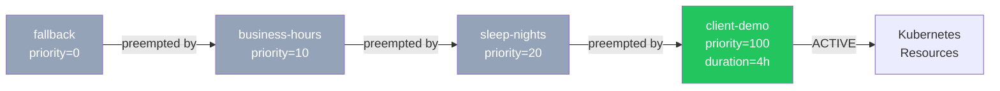
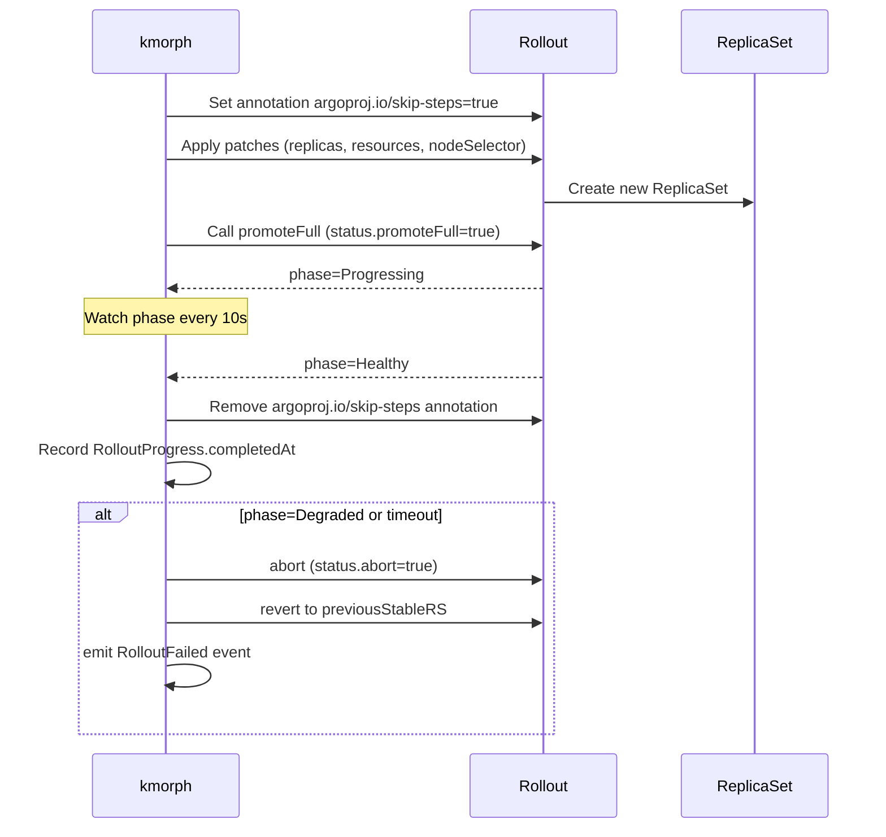
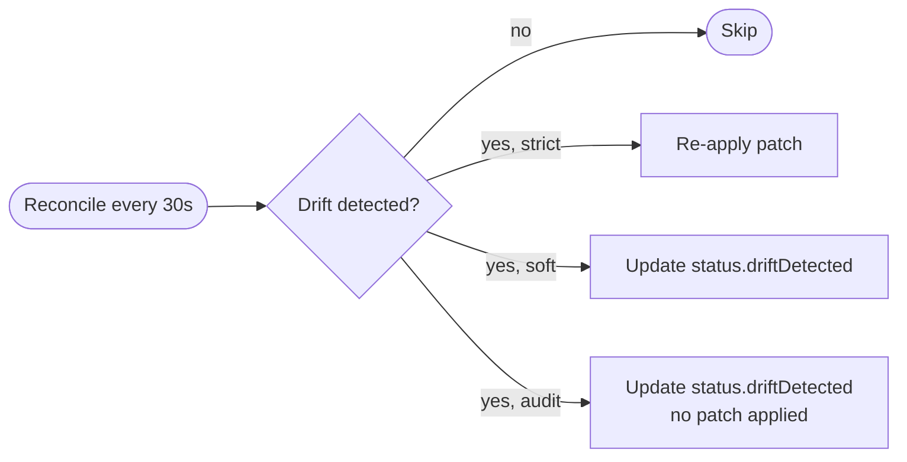
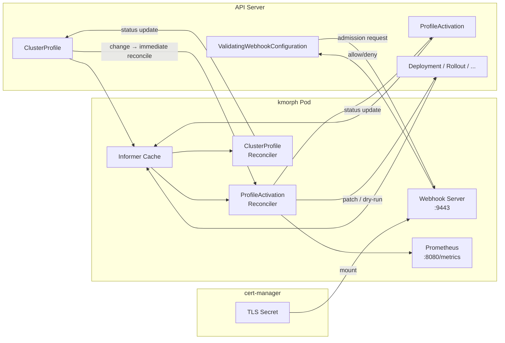
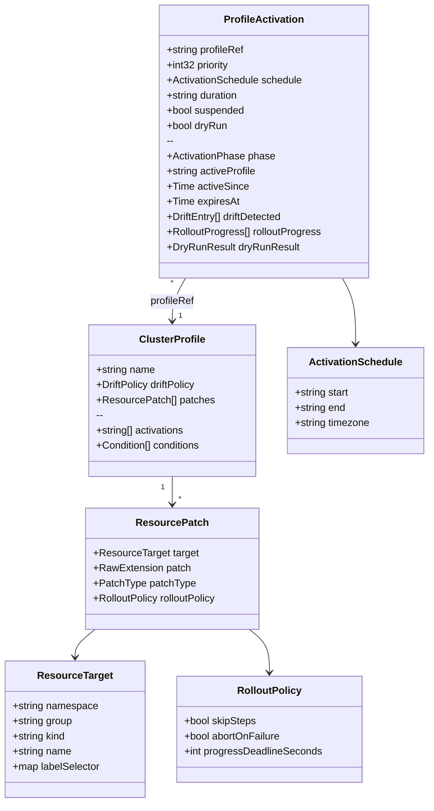

# Architecture

## Overview

kmorph consists of two CRDs and two controllers. The **ClusterProfile** defines what to patch. The **ProfileActivation** defines when and with what priority to apply it.

## Reconciliation loop

## Priority resolution

When multiple ProfileActivations are simultaneously eligible (in-window, not expired, not suspended), the controller selects the winner by:

1. **Highest `spec.priority`** wins
2. **Alphabetical name** breaks ties (deterministic)

## Argo Rollout lifecycle

When `rolloutPolicy` is set, kmorph manages the full promote lifecycle:

## Drift enforcement

In `strict` mode, kmorph re-applies patches every 30 seconds. For standard resources (Deployment, StatefulSet), it compares `spec.replicas` and other patched fields using recursive map subset check.

For Rollout resources, only `spec.replicas` is checked for drift — template fields are intentionally excluded to avoid triggering spurious canary revisions.

## Data flow

## CRD structure

