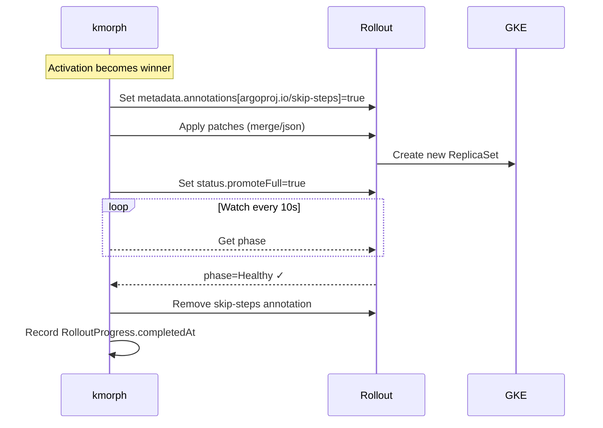
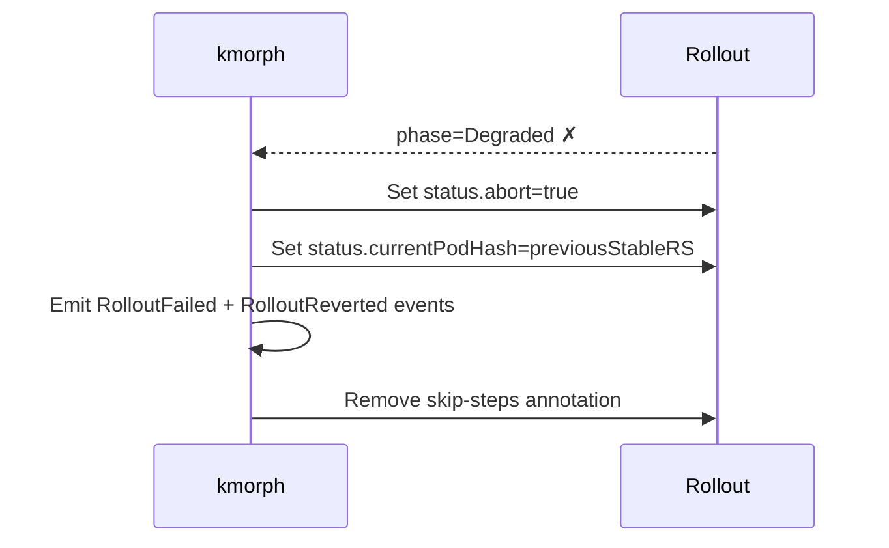

# Argo Rollouts

kmorph has first-class support for Argo Rollouts. Unlike standard Deployments, Rollouts run canary analysis on every template change — kmorph handles this automatically via `rolloutPolicy`.

## The problem

Patching `spec.template` on a Rollout creates a new revision and triggers the full canary pipeline (smoke tests, analysis, step-by-step weight shifts). This is undesirable when you just want to change replicas or resources for a staging environment.

## Solution: rolloutPolicy

```yaml
patches:
- target:
    namespace: my-app
    kind: Rollout
    group: argoproj.io
    name: my-service
  patchType: merge
  rolloutPolicy:
    skipSteps: true              # skip canary pipeline via promoteFull
    abortOnFailure: true         # revert to previousStableRS if Degraded
    progressDeadlineSeconds: 300 # timeout before treating as failed
  patch:
    spec:
      replicas: 3
```

## Promote lifecycle



If the Rollout goes `Degraded` or times out:



## Patching resources safely

Standard JSON Merge Patch replaces the entire `containers` array — this deletes the `image` field. Use `patchType: json` instead:

```yaml
# ✅ Safe: JSON patch surgically replaces only resource fields
- target:
    namespace: my-app
    kind: Rollout
    group: argoproj.io
    name: my-service
  patchType: json
  patch:
  - op: replace
    path: /spec/template/spec/containers/0/resources/requests/cpu
    value: "500m"
  - op: replace
    path: /spec/template/spec/containers/0/resources/requests/memory
    value: "768Mi"
  - op: replace
    path: /spec/template/spec/containers/0/resources/limits/cpu
    value: "500m"
  - op: replace
    path: /spec/template/spec/containers/0/resources/limits/memory
    value: "768Mi"

# ❌ Dangerous: merge patch replaces containers[], losing image
- target: ...
  patchType: merge
  patch:
    spec:
      template:
        spec:
          containers:
          - name: app
            resources: ...   # image will be lost!
```

## Full example: minimal / production profiles

```yaml
apiVersion: config.kmorph.io/v1alpha1
kind: ClusterProfile
metadata:
  name: stg-minimal
spec:
  driftPolicy: strict
  patches:
  # Patch 1: replicas via merge (rolloutPolicy manages promote lifecycle)
  - target:
      namespace: my-app
      kind: Rollout
      group: argoproj.io
      name: my-service
    patchType: merge
    rolloutPolicy:
      skipSteps: true
      abortOnFailure: true
      progressDeadlineSeconds: 300
    patch:
      spec:
        replicas: 1

  # Patch 2: resources via json (image untouched)
  - target:
      namespace: my-app
      kind: Rollout
      group: argoproj.io
      name: my-service
    patchType: json
    patch:
    - op: replace
      path: /spec/template/spec/containers/0/resources/requests/cpu
      value: "250m"
    - op: replace
      path: /spec/template/spec/containers/0/resources/requests/memory
      value: "512Mi"
---
apiVersion: config.kmorph.io/v1alpha1
kind: ClusterProfile
metadata:
  name: stg-production
spec:
  patches:
  - target:
      namespace: my-app
      kind: Rollout
      group: argoproj.io
      name: my-service
    patchType: merge
    rolloutPolicy:
      skipSteps: true
      abortOnFailure: true
      progressDeadlineSeconds: 300
    patch:
      spec:
        replicas: 3

  - target:
      namespace: my-app
      kind: Rollout
      group: argoproj.io
      name: my-service
    patchType: json
    patch:
    - op: replace
      path: /spec/template/spec/containers/0/resources/requests/cpu
      value: "500m"
    - op: replace
      path: /spec/template/spec/containers/0/resources/requests/memory
      value: "768Mi"
```

## rolloutPolicy fields

| Field | Default | Description |
|-------|---------|-------------|
| `skipSteps` | `false` | Skip all canary steps via `promoteFull`. When `false`, kmorph only patches `spec.replicas` to avoid triggering revisions. |
| `abortOnFailure` | `true` | Abort and attempt to revert to `previousStableRS` if Rollout goes `Degraded`. |
| `progressDeadlineSeconds` | `600` | Timeout for promote. If exceeded, treated as failure and aborted. |

## Tracking promote status

```bash
kubectl get pa my-activation -o jsonpath='{.status.rolloutProgress}' | jq .
```

```json
[{
  "namespace": "my-app",
  "name": "my-service",
  "phase": "Healthy",
  "previousStableRS": "abc12345",
  "patchedAt": "2026-06-10T09:00:05Z",
  "completedAt": "2026-06-10T09:01:30Z",
  "message": "promote completed successfully"
}]
```

## ArgoCD integration

kmorph and ArgoCD can coexist. When kmorph manages fields that ArgoCD also tracks, add `ignoreDifferences` to your ArgoCD Application to prevent sync conflicts:

```yaml
spec:
  ignoreDifferences:
  - group: argoproj.io
    kind: Rollout
    namespace: my-app
    name: my-service
    jsonPointers:
    - /spec/replicas
    - /spec/template/spec/containers/0/resources
    - /metadata/annotations/argoproj.io~1skip-steps
```
